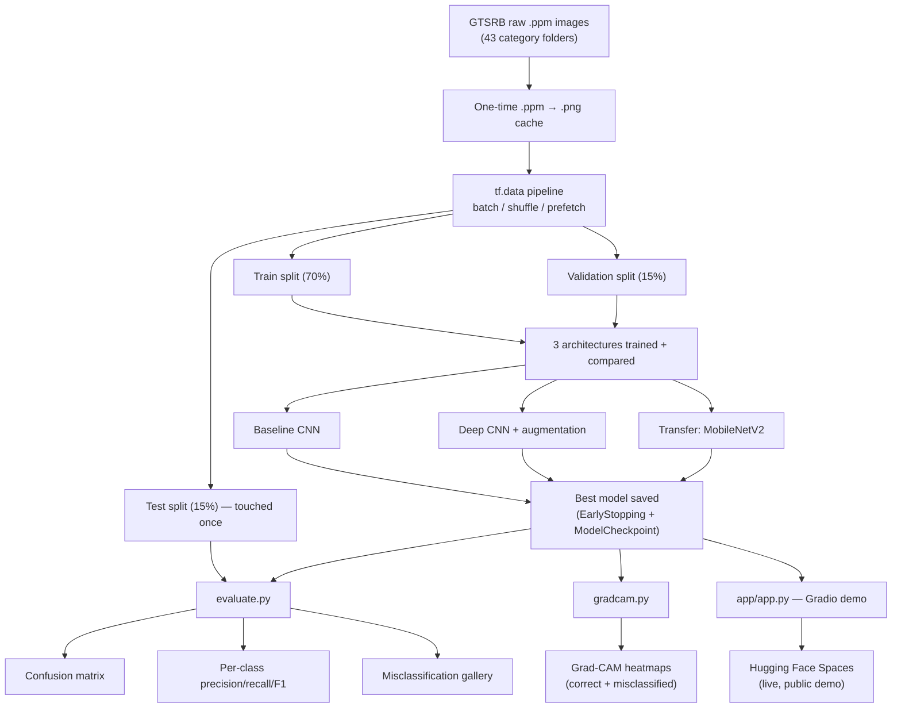

# road-sign-vision

A traffic-sign image classifier (GTSRB, 43 categories), rebuilt from a CS50AI course exercise into a full, 12-factor-compliant deep learning project — configurable via environment variables, three compared architectures, full evaluation, Grad-CAM explainability, and a live demo app.

**Live demo:** _not yet deployed — coming soon on Hugging Face Spaces_

## What this project does

Upload a photo of a traffic sign → get back a predicted category, a confidence score, and a Grad-CAM heatmap showing which part of the image the model actually looked at when deciding.

## What's built

- **Data pipeline** (`src/road_sign_vision/data.py`) — `tf.data`-based loading with a proper train/val/test split, batching, shuffling, and per-class image counts logged (GTSRB is meaningfully imbalanced across its 43 categories).
- **Three compared architectures** (`src/road_sign_vision/model.py`):
  - a small baseline CNN (the original CS50 model, kept as the control),
  - a deeper CNN with batch normalization and traffic-sign-safe data augmentation (small rotation/zoom/brightness only — no flips, since those would change a sign's meaning),
  - transfer learning on MobileNetV2 pretrained on ImageNet.
- **Experiment tracking** (`src/road_sign_vision/train.py`) — `EarlyStopping` + `ModelCheckpoint`, results logged to `reports/experiment_results.csv` for comparison.
- **Full evaluation** (`src/road_sign_vision/evaluate.py`) — confusion matrix, per-class precision/recall/F1, and a gallery of the model's most confidently-wrong predictions.
- **Explainability** (`src/road_sign_vision/gradcam.py`) — Grad-CAM heatmaps showing which pixels drove each prediction, for both correct and misclassified images.
- **Serving app** (`app/app.py`) — a stateless Gradio app that loads the saved model once and serves predictions + Grad-CAM overlays; built to run identically locally and on Hugging Face Spaces.
- **12-factor discipline throughout** — all config from environment variables (`.env.example`), structured logging to stdout, training (build) and serving (run) kept strictly separate, pinned dependencies.

## Results

| Model | Params | Val accuracy | Test accuracy | Notes |
|-------|--------|--------------|----------------|-------|
| Baseline CNN | 809,387 | 95.72% | 95.79% | control |
| **Deep CNN + augmentation** | **401,387** | **99.12%** | **99.17%** | best result, fewer params than baseline |
| MobileNetV2 (transfer) | 2,427,499 | 94.57% | 94.24% | frozen feature extractor, no fine-tuning |

See `reports/` for the confusion matrix, classification report, misclassification gallery, and Grad-CAM overlays (`reports/gradcam_correct.png`, `reports/gradcam_misclassified.png`).

## How to run

```bash
python3 -m venv venv && source venv/bin/activate
pip install -r requirements.txt

bash scripts/download_data.sh          # downloads GTSRB into data/gtsrb/

python scripts/train.py                # trains, saves models/model.keras
python scripts/evaluate.py             # confusion matrix + classification report
python scripts/gradcam.py              # Grad-CAM galleries
python app/app.py                      # runs the demo app locally
```

All config (epochs, image size, batch size, which architecture to train, augmentation on/off, etc.) is set via environment variables — see `.env.example`. For example, to compare architectures:

```bash
EXPERIMENT=deep AUGMENT=true python scripts/train.py
EXPERIMENT=transfer FINE_TUNE=false python scripts/train.py
```

## Project flow



## What this builds on

The original model architecture started as a CS50AI ("Introduction to Artificial Intelligence with Python") course exercise — a minimal CNN with no validation split, no experiment tracking, no evaluation beyond one accuracy number, and no way to inspect *why* it worked. Everything else in this repo — the data pipeline, architecture comparison, evaluation, explainability, and serving app — is original work built on top of that starting point.

## What I learned / limitations

- A three-way train/val/test split and watching validation loss during training catches overfitting that a simple train/test split misses.
- Class imbalance across GTSRB's 43 categories means accuracy alone is misleading — per-class precision/recall is what actually surfaces which categories the model struggles with.
- Grad-CAM is a cheap, effective sanity check: it confirmed the model attends to the actual sign rather than background clutter, for both correct and incorrect predictions.
- Transfer learning didn't automatically win here: a frozen, non-fine-tuned MobileNetV2 (2.4M params) underperformed a purpose-built deep CNN with only 401K params. ImageNet's natural-photo features don't transfer perfectly to small, low-resolution, symbol-like traffic-sign images without fine-tuning — a useful limitation to know rather than assume transfer learning is always the answer.
- Limitation: the transfer-learning result reported here is feature-extraction only (frozen base); fine-tuning the base layers (`FINE_TUNE=true`) was implemented but not yet run to compare.
